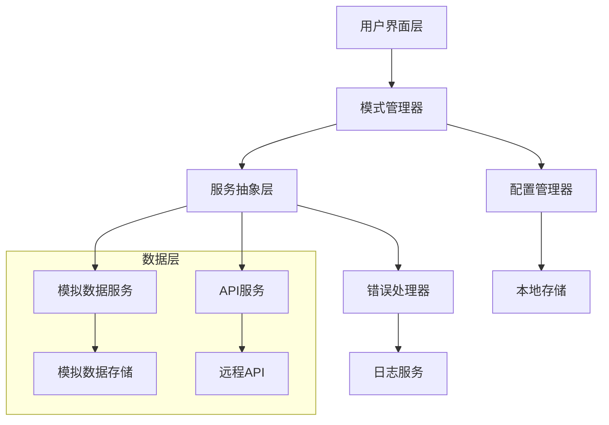
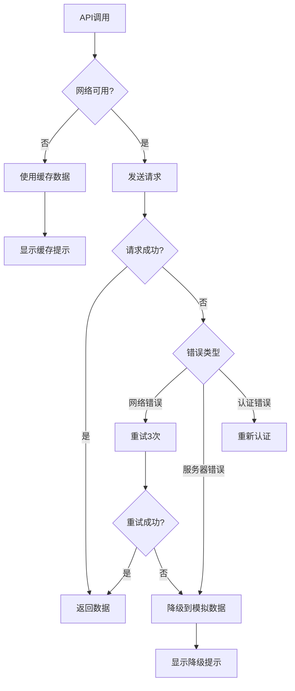

# 设计文档

## 概述

双模式系统设计旨在为HealthLink微信小程序提供灵活的运行环境，支持本地模拟数据模式和正式API模式。系统将通过配置管理、服务抽象层、错误处理机制和用户界面来实现无缝的模式切换体验。

## 架构

### 整体架构图



### 核心组件关系

1. **模式管理器** - 负责模式切换和状态管理
2. **服务抽象层** - 统一的数据访问接口
3. **配置管理器** - 管理应用配置和模式设置
4. **错误处理器** - 统一的错误处理和降级机制

## 组件和接口

### 1. 模式管理器 (ModeManager)

```typescript
interface IModeManager {
  getCurrentMode(): 'mock' | 'api'
  switchMode(mode: 'mock' | 'api'): Promise<boolean>
  isApiMode(): boolean
  isMockMode(): boolean
  onModeChange(callback: (mode: string) => void): void
}
```

**职责：**
- 管理当前运行模式
- 处理模式切换逻辑
- 通知模式变更事件
- 持久化模式设置

### 2. 服务抽象层 (ServiceLayer)

```typescript
interface IDataService {
  getHealthData(): Promise<HealthData[]>
  submitHealthData(data: HealthDataInput): Promise<boolean>
  getHealthAssessment(): Promise<HealthAssessment>
  getDoctorMessages(): Promise<DoctorMessage[]>
  sendMessageToDoctor(content: string): Promise<boolean>
  getUserStats(): Promise<UserStats>
}
```

**职责：**
- 提供统一的数据访问接口
- 根据当前模式路由到相应的服务实现
- 处理数据格式转换
- 实现缓存机制

### 3. 模拟数据服务 (MockDataService)

```typescript
interface IMockDataService extends IDataService {
  loadMockData(): void
  resetMockData(): void
  addMockRecord(data: any): void
  getMockDataStatus(): MockDataStatus
}
```

**职责：**
- 提供预设的模拟数据
- 管理本地数据存储
- 模拟API响应延迟
- 支持数据重置功能

### 4. API服务 (ApiService)

```typescript
interface IApiService extends IDataService {
  setBaseUrl(url: string): void
  setAuthToken(token: string): void
  getConnectionStatus(): Promise<boolean>
  enableFallbackMode(enabled: boolean): void
}
```

**职责：**
- 处理真实的API调用
- 管理网络连接状态
- 实现自动降级机制
- 处理认证和授权

### 5. 配置管理器 (ConfigManager)

```typescript
interface IConfigManager {
  getConfig(key: string): any
  setConfig(key: string, value: any): void
  loadConfig(): Promise<void>
  saveConfig(): Promise<void>
  resetConfig(): void
}
```

**职责：**
- 管理应用配置
- 处理配置的持久化
- 提供配置变更通知
- 支持配置重置

### 6. 错误处理器 (ErrorHandler)

```typescript
interface IErrorHandler {
  handleError(error: Error, context: string): void
  shouldFallback(error: Error): boolean
  getErrorMessage(error: Error): string
  reportError(error: Error): void
}
```

**职责：**
- 统一错误处理逻辑
- 决定是否需要降级
- 提供用户友好的错误信息
- 记录错误日志

## 数据模型

### 1. 模式配置模型

```typescript
interface ModeConfig {
  currentMode: 'mock' | 'api'
  apiBaseUrl: string
  mockDataEnabled: boolean
  fallbackEnabled: boolean
  lastSwitchTime: number
  switchCount: number
}
```

### 2. 服务状态模型

```typescript
interface ServiceStatus {
  mode: 'mock' | 'api'
  isOnline: boolean
  lastApiCall: number
  errorCount: number
  fallbackActive: boolean
}
```

### 3. 错误信息模型

```typescript
interface ErrorInfo {
  code: string
  message: string
  timestamp: number
  context: string
  shouldFallback: boolean
  userMessage: string
}
```

## 错误处理

### 1. 错误分类

- **网络错误** - 连接超时、网络不可用
- **API错误** - 服务器错误、认证失败
- **数据错误** - 数据格式错误、验证失败
- **系统错误** - 模块加载失败、内存不足

### 2. 降级策略



### 3. 错误恢复机制

- **自动重试** - 网络错误时自动重试最多3次
- **智能降级** - API失败时自动切换到模拟数据
- **状态恢复** - 网络恢复后自动切换回API模式
- **用户通知** - 及时通知用户当前状态和可用操作

## 测试策略

### 1. 单元测试

- **模式管理器测试** - 测试模式切换逻辑
- **服务层测试** - 测试数据访问接口
- **错误处理测试** - 测试各种错误场景
- **配置管理测试** - 测试配置的读写操作

### 2. 集成测试

- **模式切换测试** - 测试完整的模式切换流程
- **数据一致性测试** - 测试不同模式下的数据一致性
- **错误恢复测试** - 测试错误恢复机制
- **性能测试** - 测试模式切换的性能影响

### 3. 用户体验测试

- **界面响应测试** - 测试模式切换时的界面响应
- **数据展示测试** - 测试不同模式下的数据展示
- **错误提示测试** - 测试错误提示的友好性
- **操作流畅性测试** - 测试整体操作的流畅性

## 实现细节

### 1. 模块依赖修复

当前项目中存在`miniprogram-api`模块未定义的问题，需要：

- 创建自定义的类型定义文件
- 实现微信小程序API的TypeScript包装
- 修复页面文件中的导入错误
- 确保所有模块正确加载

### 2. 资源管理

解决图片资源加载失败的问题：

- 检查并修复图片路径
- 实现资源预加载机制
- 添加资源加载失败的降级处理
- 优化资源加载性能

### 3. 状态管理

实现全局状态管理：

- 使用微信小程序的全局数据管理
- 实现状态变更的响应式更新
- 确保状态在页面间的一致性
- 提供状态调试工具

### 4. 用户界面设计

设计直观的模式切换界面：

- 在设置页面添加模式切换开关
- 在主界面显示当前模式状态
- 提供模式说明和帮助信息
- 实现模式切换的动画效果

### 5. 性能优化

确保模式切换不影响性能：

- 实现懒加载机制
- 优化数据缓存策略
- 减少不必要的网络请求
- 实现智能预加载

## 安全考虑

### 1. 数据安全

- 模拟数据不包含真实用户信息
- API模式下的数据传输加密
- 本地存储数据的安全性
- 敏感信息的脱敏处理

### 2. 访问控制

- API访问的身份验证
- 模式切换的权限控制
- 数据访问的授权机制
- 防止未授权的模式切换

### 3. 错误信息安全

- 避免在错误信息中泄露敏感数据
- 对外部用户隐藏内部实现细节
- 安全的错误日志记录
- 防止通过错误信息进行攻击