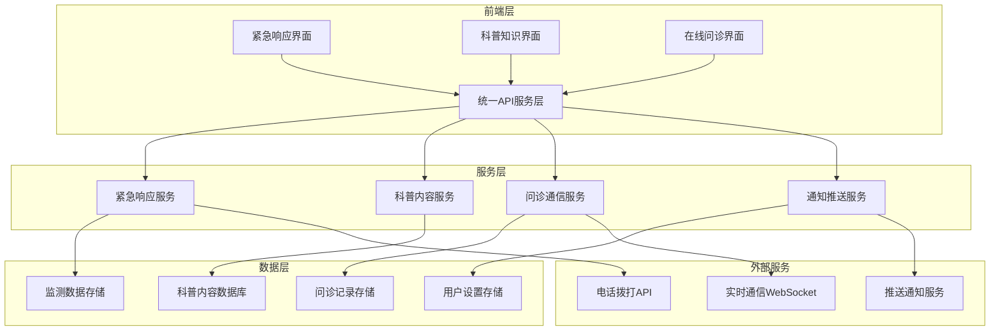

# 设计文档

## 概述

本设计文档描述了健康监护系统三个核心功能的技术实现方案：24小时紧急情况自动响应、健康科普知识库和在线问诊服务。设计基于现有的Next.js + TypeScript + 微信小程序混合架构，采用模块化设计确保功能的可扩展性和可维护性。

## 架构

### 整体架构图



### 技术栈选择

- **前端框架**: Next.js 15 + React 19 + TypeScript
- **UI组件库**: Radix UI + Tailwind CSS
- **状态管理**: React Hook Form + Zustand
- **实时通信**: WebSocket + Socket.io
- **数据存储**: 本地存储 + 云端同步
- **推送通知**: 微信小程序推送 + Web Push API

## 组件和接口

### 1. 紧急响应模块

#### 核心组件
```typescript
interface EmergencyResponse {
  id: string
  userId: string
  triggerTime: Date
  vitalsData: VitalsSnapshot
  severity: 'critical' | 'urgent' | 'warning'
  responseActions: EmergencyAction[]
  status: 'triggered' | 'acknowledged' | 'resolved'
}

interface VitalsSnapshot {
  heartRate?: number
  bloodPressure?: { systolic: number; diastolic: number }
  temperature?: number
  oxygenSaturation?: number
  timestamp: Date
}

interface EmergencyAction {
  type: 'call_120' | 'call_doctor' | 'alert_family'
  priority: number
  executed: boolean
  executedAt?: Date
}
```

#### 监测服务接口
```typescript
interface IEmergencyMonitoringService {
  startMonitoring(userId: string): Promise<void>
  stopMonitoring(userId: string): Promise<void>
  checkVitals(data: VitalsSnapshot): Promise<EmergencyResponse | null>
  triggerEmergencyResponse(response: EmergencyResponse): Promise<void>
  acknowledgeEmergency(responseId: string): Promise<void>
}
```

### 2. 科普知识模块

#### 数据模型
```typescript
interface HealthArticle {
  id: string
  title: string
  content: string
  summary: string
  category: HealthCategory
  tags: string[]
  images: ArticleImage[]
  author: string
  publishDate: Date
  readCount: number
  difficulty: 'basic' | 'intermediate' | 'advanced'
}

interface HealthCategory {
  id: string
  name: string
  icon: string
  parentId?: string
  description: string
}

interface ArticleImage {
  url: string
  caption: string
  alt: string
}
```

#### 搜索服务接口
```typescript
interface IHealthEducationService {
  searchArticles(query: string, filters?: SearchFilters): Promise<HealthArticle[]>
  getArticlesByCategory(categoryId: string): Promise<HealthArticle[]>
  getArticleById(id: string): Promise<HealthArticle>
  getPopularArticles(limit?: number): Promise<HealthArticle[]>
  recordReadHistory(userId: string, articleId: string): Promise<void>
  getRecommendations(userId: string): Promise<HealthArticle[]>
}

interface SearchFilters {
  category?: string
  difficulty?: string
  dateRange?: { start: Date; end: Date }
}
```

### 3. 在线问诊模块

#### 数据模型
```typescript
interface Doctor {
  id: string
  name: string
  avatar: string
  title: string
  department: string
  specialties: string[]
  experience: number
  rating: number
  reviewCount: number
  isOnline: boolean
  consultationFee: number
  introduction: string
}

interface Consultation {
  id: string
  doctorId: string
  userId: string
  status: 'pending' | 'active' | 'completed' | 'cancelled'
  startTime: Date
  endTime?: Date
  messages: ConsultationMessage[]
  summary?: string
}

interface ConsultationMessage {
  id: string
  consultationId: string
  senderId: string
  senderType: 'doctor' | 'patient'
  content: string
  messageType: 'text' | 'image' | 'voice' | 'file'
  timestamp: Date
  isRead: boolean
}
```

#### 问诊服务接口
```typescript
interface IConsultationService {
  getDoctorList(filters?: DoctorFilters): Promise<Doctor[]>
  getDoctorById(id: string): Promise<Doctor>
  startConsultation(doctorId: string, userId: string): Promise<Consultation>
  sendMessage(consultationId: string, message: Omit<ConsultationMessage, 'id' | 'timestamp'>): Promise<void>
  getConsultationHistory(userId: string): Promise<Consultation[]>
  endConsultation(consultationId: string, summary?: string): Promise<void>
}

interface DoctorFilters {
  department?: string
  specialty?: string
  isOnline?: boolean
  minRating?: number
}
```

## 数据模型

### 数据库设计

#### 紧急响应相关表
```sql
-- 紧急响应记录表
CREATE TABLE emergency_responses (
  id VARCHAR(36) PRIMARY KEY,
  user_id VARCHAR(36) NOT NULL,
  trigger_time TIMESTAMP NOT NULL,
  vitals_data JSON NOT NULL,
  severity ENUM('critical', 'urgent', 'warning') NOT NULL,
  status ENUM('triggered', 'acknowledged', 'resolved') NOT NULL,
  created_at TIMESTAMP DEFAULT CURRENT_TIMESTAMP,
  updated_at TIMESTAMP DEFAULT CURRENT_TIMESTAMP ON UPDATE CURRENT_TIMESTAMP
);

-- 紧急响应动作表
CREATE TABLE emergency_actions (
  id VARCHAR(36) PRIMARY KEY,
  response_id VARCHAR(36) NOT NULL,
  action_type ENUM('call_120', 'call_doctor', 'alert_family') NOT NULL,
  priority INT NOT NULL,
  executed BOOLEAN DEFAULT FALSE,
  executed_at TIMESTAMP NULL,
  FOREIGN KEY (response_id) REFERENCES emergency_responses(id)
);
```

#### 科普内容相关表
```sql
-- 健康文章表
CREATE TABLE health_articles (
  id VARCHAR(36) PRIMARY KEY,
  title VARCHAR(255) NOT NULL,
  content TEXT NOT NULL,
  summary TEXT,
  category_id VARCHAR(36) NOT NULL,
  author VARCHAR(100) NOT NULL,
  publish_date TIMESTAMP NOT NULL,
  read_count INT DEFAULT 0,
  difficulty ENUM('basic', 'intermediate', 'advanced') NOT NULL,
  created_at TIMESTAMP DEFAULT CURRENT_TIMESTAMP
);

-- 文章分类表
CREATE TABLE health_categories (
  id VARCHAR(36) PRIMARY KEY,
  name VARCHAR(100) NOT NULL,
  icon VARCHAR(50),
  parent_id VARCHAR(36) NULL,
  description TEXT,
  sort_order INT DEFAULT 0
);

-- 用户阅读历史表
CREATE TABLE user_reading_history (
  id VARCHAR(36) PRIMARY KEY,
  user_id VARCHAR(36) NOT NULL,
  article_id VARCHAR(36) NOT NULL,
  read_at TIMESTAMP DEFAULT CURRENT_TIMESTAMP,
  FOREIGN KEY (article_id) REFERENCES health_articles(id)
);
```

#### 问诊相关表
```sql
-- 医生信息表
CREATE TABLE doctors (
  id VARCHAR(36) PRIMARY KEY,
  name VARCHAR(100) NOT NULL,
  avatar VARCHAR(255),
  title VARCHAR(100) NOT NULL,
  department VARCHAR(100) NOT NULL,
  specialties JSON,
  experience INT NOT NULL,
  rating DECIMAL(3,2) DEFAULT 0.00,
  review_count INT DEFAULT 0,
  consultation_fee DECIMAL(10,2) NOT NULL,
  introduction TEXT,
  is_online BOOLEAN DEFAULT FALSE,
  created_at TIMESTAMP DEFAULT CURRENT_TIMESTAMP
);

-- 问诊记录表
CREATE TABLE consultations (
  id VARCHAR(36) PRIMARY KEY,
  doctor_id VARCHAR(36) NOT NULL,
  user_id VARCHAR(36) NOT NULL,
  status ENUM('pending', 'active', 'completed', 'cancelled') NOT NULL,
  start_time TIMESTAMP NOT NULL,
  end_time TIMESTAMP NULL,
  summary TEXT,
  created_at TIMESTAMP DEFAULT CURRENT_TIMESTAMP,
  FOREIGN KEY (doctor_id) REFERENCES doctors(id)
);

-- 问诊消息表
CREATE TABLE consultation_messages (
  id VARCHAR(36) PRIMARY KEY,
  consultation_id VARCHAR(36) NOT NULL,
  sender_id VARCHAR(36) NOT NULL,
  sender_type ENUM('doctor', 'patient') NOT NULL,
  content TEXT NOT NULL,
  message_type ENUM('text', 'image', 'voice', 'file') NOT NULL,
  is_read BOOLEAN DEFAULT FALSE,
  created_at TIMESTAMP DEFAULT CURRENT_TIMESTAMP,
  FOREIGN KEY (consultation_id) REFERENCES consultations(id)
);
```

## 错误处理

### 错误分类和处理策略

#### 1. 紧急响应错误处理
```typescript
enum EmergencyErrorType {
  MONITORING_FAILURE = 'MONITORING_FAILURE',
  ALERT_DELIVERY_FAILURE = 'ALERT_DELIVERY_FAILURE',
  PHONE_CALL_FAILURE = 'PHONE_CALL_FAILURE',
  DATA_CORRUPTION = 'DATA_CORRUPTION'
}

class EmergencyErrorHandler {
  static handle(error: EmergencyErrorType, context: any): void {
    switch (error) {
      case EmergencyErrorType.MONITORING_FAILURE:
        // 重启监测服务，记录错误日志
        this.restartMonitoring(context.userId)
        break
      case EmergencyErrorType.ALERT_DELIVERY_FAILURE:
        // 尝试备用通知方式
        this.tryAlternativeAlert(context.alertData)
        break
      case EmergencyErrorType.PHONE_CALL_FAILURE:
        // 显示手动拨号界面
        this.showManualDialInterface(context.phoneNumber)
        break
    }
  }
}
```

#### 2. 网络错误处理
```typescript
class NetworkErrorHandler {
  static async handleApiError(error: any, fallbackData?: any): Promise<any> {
    if (error.code === 'NETWORK_ERROR') {
      // 使用缓存数据
      return this.getCachedData() || fallbackData
    }
    
    if (error.code?.startsWith('HTTP_5')) {
      // 服务器错误，启用降级模式
      return this.enableFallbackMode()
    }
    
    throw error
  }
}
```

## 测试策略

### 单元测试
- **紧急响应逻辑测试**: 测试各种生命体征异常情况的检测和响应
- **搜索算法测试**: 测试科普内容的搜索准确性和性能
- **消息传递测试**: 测试问诊消息的发送、接收和状态更新

### 集成测试
- **端到端紧急响应流程**: 从异常检测到通知发送的完整流程
- **实时通信测试**: 医生和患者之间的实时消息传递
- **数据同步测试**: 本地数据与云端数据的同步机制

### 性能测试
- **监测服务性能**: 24小时连续监测的资源消耗和稳定性
- **搜索响应时间**: 大量科普内容下的搜索性能
- **并发问诊处理**: 多个用户同时进行问诊的系统负载

### 安全测试
- **数据加密验证**: 敏感健康数据的加密存储和传输
- **身份认证测试**: 医生和患者身份验证的安全性
- **权限控制测试**: 不同角色的数据访问权限控制

### 用户体验测试
- **紧急情况响应时间**: 从异常检测到用户看到提示的时间
- **界面易用性**: 各功能模块的操作流畅性和直观性
- **离线功能**: 网络不稳定情况下的功能可用性